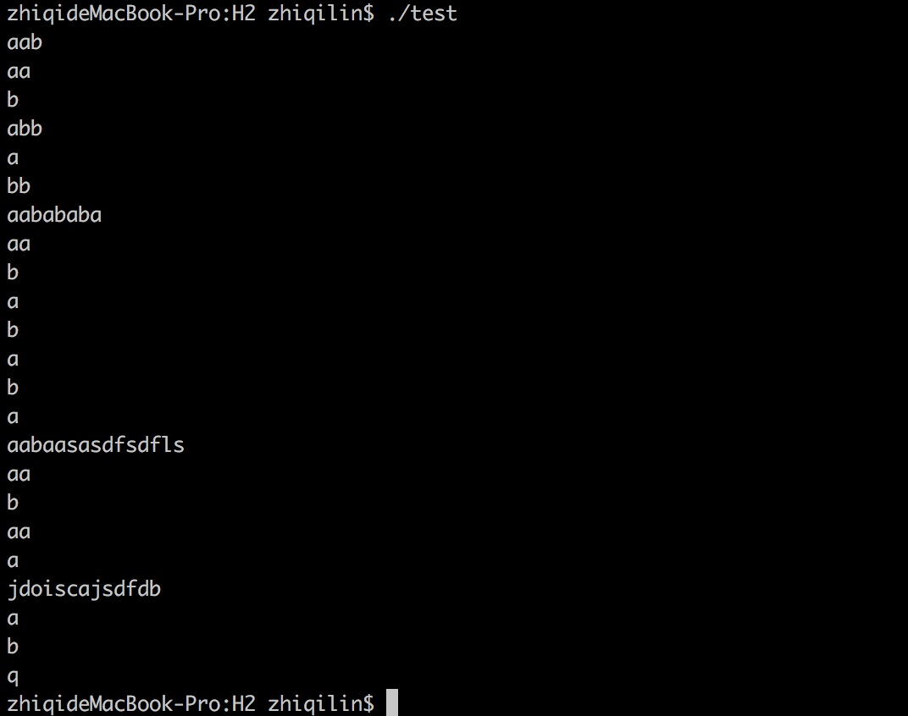

# Howwork 2
PB15111672 林郅琦

## 源码编译使用
* 要求系统具备g++，支持 c++11  
* 编译: 在 Makefile 目录下 `$make` 即可  
* 源码目录及用途  
```
Makefile
compiler.h			// 头文件
compiler.cc			// 头文件函数定义
test.cc				// 测试文件(含 main)
README.md			// Markdown 说明文件
```  

## 代码使用方式  
* 编译 make 完成后，使用命令 `$./test` 即可开始运行程序  
* 有用户指定输入，单次输入可以是不超过 99 个字符数的任意字符串，程序匹配按照空格、回车对输入进行分割匹配，输入首字母为 q 时将退出程序  
* 程序运行效果大致如下:  
    

## 源码结构
* compiler.h  
  内含两个类：  
  1. NfaForm: 组成 NFA 转换表的类，主要数据结构分为三部分：  
    (1). unordered_map\<int, unordered\_map\<char, set\<int> > >  
       三元组表示转换表 <current\_state, input, next\_state\_set>  
    (2). int start\_state\_ 匹配开始状态(默认为0)  
    (3). set\<int> end\_state\_  转换图末端状态集合  
    主要成员函数为:  
    (1). GetMoveSet(int curr_state, char input); 返回三元组的第三个参数： next_state_set 集合用于查询可转换的状态列表  
    (2). Find(int curr_state, char input, int next_state); 确定是否存在该三元组转换路径  
    (3). AddSet(...); 添加三元组构成 Nfa 转换表  
  2. Compiler: 整个编译器的类(也用于后续作业逐步完善)  
     本处只用到 bool MatchNfa(); 成员函数功能  
     MatchNfa() 算法参考课本 2.3.3 对输入字符串进行匹配，具体流程为：  
     (1). 从初始状态集 T (默认为0)开始  
     (2). 利用广度优先搜索，将 T 中所有节点（一个 state 算做一个节点，下同）能通过空串访问到的节点都加入到 T 中  
     (3). 判断此时是否已经完成正则匹配
     (4). 读入一个字符，从 T 中找出能通过该字符访问的下一个节点的集合并代替 T
     (5). 如果此时 T为空，则由(3)的判断决定是否输出前面的字符串，并做错误恢复处理  
     (6). 重复(2)~(5) 步骤直到所有字符串读入完毕(或遇到分隔符，本程序为空格)，若剩余 T 中还存在节点并且该节点术语 end\_state\_ 则认为匹配成功，否则失败  

* compiler.cc负责对 MatchNfa() 的实现  
* test.cc 手动构建 nfa 转换图并测试代码正确性 

## aaab 识别过程
* 按照课件第29页的 NFA，开始状态集 T = {0}
* 广度优先搜索后状态集 T = {0, 1, 3}
* 读入一个字符为 a，转换后的状态集 T = {2}
* 广度优先搜索后状态集 T = {2}
* 读入一个字符为 a，转换后的状态集 T = {2}
* 广度优先搜索后状态集 T = {2}
* 读入一个字符为 a，转换后的状态集 T = {2}
* 广度优先搜索后状态集 T = {2}
* 读入一个字符为 b，转换后的状态集 T = { }，由前面知已经达到正则匹配，输出 aaa，指针回退，状态集 T={0}
* 广度优先搜索后状态集 T = {0, 1, 3}
* 读入一个字符为 b，转换后的状态集 T = {4}
* 读入结束，已经达到正则匹配，输出 b
