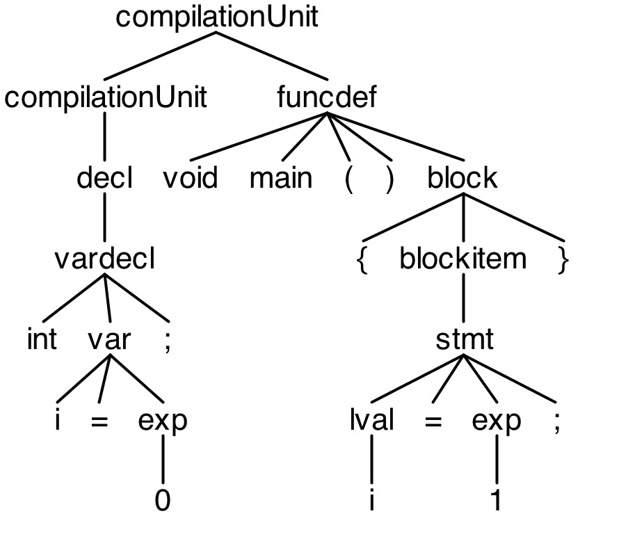
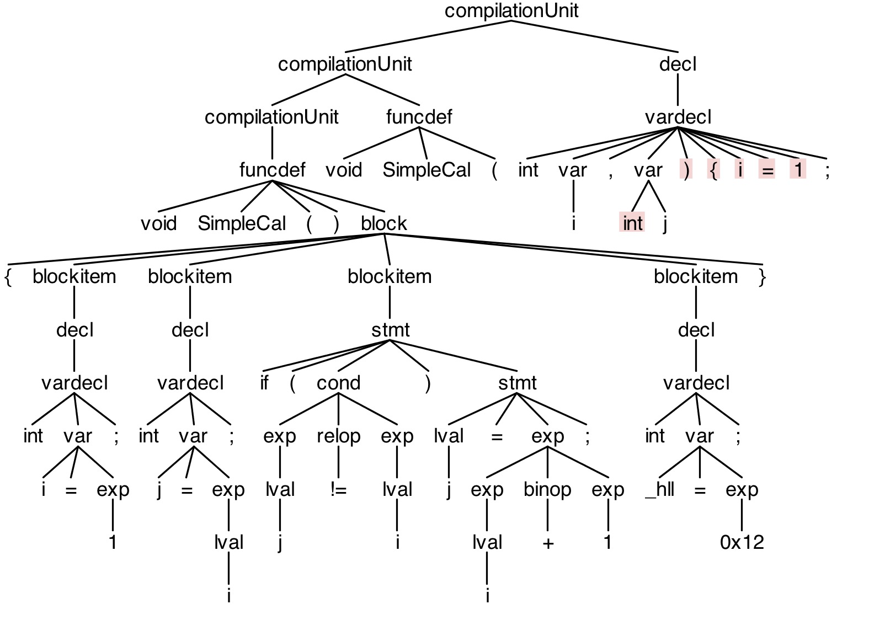

# Lab 1-2 实验报告
PB15111672 林郅琦  

## 实验内容
> 根据 C1语言 的 EBNF 描述，修改并完善课程实验软件包中 C1 的语法描述文件c1recognizer/grammar/C1Parser.g4，利用 ANTLR v4 节介绍的 antlr4 和 grun 工具编译和测试你的分析器。请编写若干个正确的和错误的 C1 程序作为测试程序，来测试你所构造的 C1 语法分析器。

## 编译目录
* 编译需要用到的文件夹内容为以下部分:  

```
- c1recognizer/
	- grammar/
		- C1Lexer.g4
		- C1Parser.g4
	- test/
		- test_cases/
			- simple.c1
			- lexer
```

## 编译执行指令
* 编译前请确定已经正常使用 antlr4 ,grun, javac 命令
* **编译执行 C1 Parser:**  
```  sh
cd into grammar file
$rm -f *.java *.class *.tokens
$antlr4 C1Lexer.g4 C1Parser.g4
$javac *.java
$grun C1 compilationUnit -gui ../test/test_cases/simple.c1
$grun C1 compilationUnit -gui ../test/test_cases/lexer
```

## 实验过程

### 实现 C1Parser
* C1 语言文法采用 EBNF 表示，具体表示内容见 [C1文法](https://clarazhang.gitbooks.io/compiler-f2017/content/parser.html)  
* 只需要将 C1Parser.g4 中的内容补齐即可，其中第一项  `compilationUnit` 需要修改其左递归，展开即可: `compilationUnit: decl | funcdef | compilationUnit (decl | funcdef) EOF;`
* 其他部分修改为对应的 C1Lexer token 输出记号即可，修改过程简单，见 c1recognizer/grammar/C1Parser.g4

## 实验结果和分析

### C1 Parser 实验结果
* 实验结果采用 test/test_cases/simple.c1 和 test/test_cases/lexer 来查看实验的正确性
* gui 输出结果如下:  
  * simple.c1 分析树 (程序正确，终端没有报错提示):  

      

  * lexer 分析树 (由于lexer 中有不正确的函数，所以终端会提示报错信息):  

      

### C1 Parser 实验分析
* 从实验输出分析树来看，实验结果符合预期，即从此测试算例来看，实现没有出现问题。