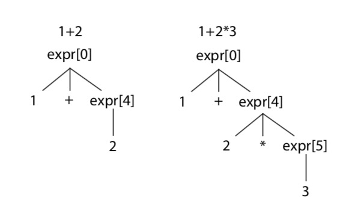

# Lab 1-3 实验报告

PB15111672 林郅琦

## 实验内容

- 了解、使用ANTLR分析树的编程接口，书面总结它们与你在lab1-2中写的文法之间的关系；
- 学习使用 Vistor 访问者模式来构建AST；
- 深入理解ANTLR的分析原理，结合生成的解析器源码以及所调用的ANTLR运行时的实现代码，调研相关的文献，回答相关问题；


## 实验分析

* 首先是 Antlr Visitor 模式：

  * Visitor 模式主要通过调用 `antlrcpp::Any visitGrammarContext(GrammarContext * ctx)` 来遍历整个分析树（由 Lab1-2得到）来生成语义树。其基本模式是通过预测分析法来进行递归调用。

  * Visitor 模式中，visit 接口由自己实现，基本的树的节点数据结构也有自己实现，实验初始代码中已经给定了树节点的数据结构，因此我们的工作是完成  

    `antlrcpp::Any visitGrammarContext(GrammarContext * ctx)` 中的具体函数实现。

  * 具体函数实现的策略为：通过文法以及接口判断对应的产生式，再通过产生式中的非终结符递归调用 visit  函数访问对应的文法。

* 整个实验采用的是智能指针和 Visitor 模式下相关函数的相互，并且每个 visit 返回值均为 `antlrcpp::Any` ，这要求在打包和解包时要保证数据类型的不变性（或者有继承关系）。

* 由于要处理形如 `const i = 0;` 这类文法，并默认此时的 i 具备 integer 类型，生成语义树的时候给出 warning 提示信息，因此需要重新修改 C1grammar.g4 文件中的 Const 对应文法。

## 实验设计

* 通过自定向下的实现每个 visit 函数功能（即从 compilationUnit 开始向下），同时由上层调用关系确定对应函数的返回值。
* compilationUnit 部分从数据结构中的 assembly 结构开始，通过遍历其孩子节点以及访问 decl 和 funcdef，再逐步构建 decl 和 funcdef 的 visit 函数，依次向下。
* 本次实验通过阅读源码获得相关的 antlrcpp API 调用信息，重要的 API  和数据结构通过 C1Parser.cpp 和 C1Parser.h 获得。本次实验中使用的特别的 API 如下：
  * `GrammarContext.children` 成员：记录了 Parser Tree 下的孩子节点
  * `antlrcpp::is<T *>()` 函数：检测某个 Parser Tree 节点是否与相应的 T 类型匹配（通过阅读 C1Parser.cpp 跟踪函数定义获得）
  * 以上两个 API 将分别被用到 compilationUnit 和 block 的 visit 函数中，用来确定形如 (A | B)\* 的顺序关系。
* 本次实验还将处理几个特殊的地方：
  * 对 vardef 和 constdef 文法的处理：
    * 首先要判断 exp 是否出现在 [ ]中，判断的方式可以为通过判断逗号的数量。（因为后面的文法表明一个逗号与一个 exp 相匹配，因此如果逗号的数量比 exp 的数量小 2，则表明 [ ] 中有 exp 的出现）
    * 其次是当 exp 不在[ ]中出现时，要通过判断逗号的数量来确定 [ ] 中应当填入的数字，具体地，数组的长度应当等于逗号数 + 1。
  * 对 constdecl 和 decl 的处理：
    * 首先基本的数据类型为 `ptr<var_def_stmt_syntax>` ，由于 constdecl （decl）可能有1个或多个 constdef（def）组成，所以考虑相应的 visit 函数返回为 `ptr_list<var_def_stmt_syntax>` .
* 其他的设计过程主要考虑在函数返回打包和函数调用解包的问题上，具体的实现细节可以阅读要求补充的源码实现。

## 实验编译

* 按照实验首页上的两次 cmake，两次 make 即可正常编译运行。
* 测试示例位于 c1recognizer/test/test\_cases/test\_tree.c1 中（这是一个正确的会报 warning 的示例）。

## 实验结果

* 实验结果正确，测试样例中已经尽可能体现各种文法，最后 Syntax Tree 的输出与助教提供的二进制文件输出结果相同。
* 其他个别测试中输出结果也符合预期，因此本次实现暂未发现编译生成的二进制可执行文件有不足的地方。

## 实验遇到的困难和解决方案

* 最主要的困难是刚开始并不太理解整个 Visitor 模式和实现的方式，后来通过输出助教的测试文件有了大概的流程，再通过看助教写的未完整的 visitExp() 代码就了解了大概的流程。
* 其次的困难是函数返回打包和调用 `as<>()` 解包的一致性要求，后来也通过修改代码完成。


## 重难点问题解答

1. ATN的英文全称是什么，它代表什么？
   * ATN 全称为 Augmented Transition Networks，中文名为扩充转移网络。**ATN 是一个 Parser**，用于自然语言处理（NLP) 中。1970年美国人工智能专家W.A.伍兹提出。它采用状态图来控制自然语言的分析过程。每幅状态图相当于一个网络，由状态和边构成，在状态图的各条边上，可以注明所分析的词，或词组类型符号。每一个词组类型符号又可以作为一个子网络的开头，因而当采用扩充转移网络来分析自然语言的句子时，如果分析到某一词组类型符号，就可以转移到相应的子网络，如果处理结束或处理失败，可再回到原来的网络继续进行分析，直到分析完整个句子为止。

2. SLL的英文全称是什么，它和LL、以及ALL(\*)的区别是什么? 它们分别怎么对待文法二义、试探回溯？
   * SLL: 英文全称 Strong Leftmost Left-to-Right，是 LL 的一个子类
   * SLL(k) 和 LL(k) 的区别：首先 SLL(k) 是 LL(k) 的子集。LL(k) 在做分析的时候从左到右读取字符串，它不仅需要还没有读入的字符的信息（即将到来的字符信息），也需要已经读了的字符串的历史信息（特例 LL(1)是不需要历史信息的），通过历史信息和未来信息的结合确定产生式的选择。而 SLL(k) 虽然也需要未来 k 个的字符信息，但不同于 LL(k)的是，SLL(k) 不需要历史信息即能做出产生式的选择，因此带有 "Strong"。链接: [sll](https://www.quora.com/What-is-meant-by-strong-LL-k-grammar-How-is-it-different-from-LL-k-grammars)
   * ALL(\*): ALL(\*) 中的 A 是（Adaptive）自适应的意思，ALL(\*) 改进了LL(\*) 的前瞻算法，其在碰到多个可选分支的时候，会为每一个分支运行一个子解析器，每一个子解析器都有自己的DFA（deterministic finite automata，确定性有限态机器），这些子解析器以伪并行（pseudo-parallel）的方式探索所有可能的路径，当某一个子解析器完成匹配之后，它走过的路径就会被选定，而其他的子解析器会被杀死，本次决策完成。也就是说，ALL(\*)解析器会在运行时反复的扫描输入，这是一个牺牲计算资源换取更强解析能力的算法。在最坏的情况下，这个算法的复杂度为O(n^4)，它帮助ANTLR在解决歧义与分支决策的时候更加智能。链接：[ALL(\*)](https://toutiao.io/posts/sh94p8/preview)
   * ALL(\*)与 SLL(\*)的关系：antlr4中，ALL(\*)包含了另一个分析策略，即为 SLL(\*), 这个过程不含回溯，但功能不如 LL(*)强大，但优点是速度快。
   * 对待二义和试探回溯：实际上 SLL 和 LL 都要求文法是无二义性的，这取决于他们的定义。但是在 antlr4 中可以出现二义性的定义，其解决方案是通过优先级的定义来使文法不再二义。有关试探性回溯的问题，antlr4 采用的是基于 ALL(\*) 和 ATN 的方法，原来的 LL(\*) 是需要回溯的，ALL(\*) 通过伪并行消除了所需的回溯，因此 ALL(*) 是不需要回溯的。

3. 了解并总结`enterRecursionRule`、`unrollRecursionContexts`、`adaptivePredict` 函数的作用、接口和主要处理流程。

   * 首先是 Antlr4 处理左递归的方式：Antlr4 通过透明的将左递归替换为一个判定循环（predicated loop）,通过比较前面操作数的优先级（需要用到优先级栈）和下一个操作符的优先级来进行优先级爬升，并根据文法结构（默认 | 之前优先级越高）重新生成带优先级信息的文法产生式串，来进行一步步的迭代。下图简略的显示了重新定义后的 exp 文法产生式规则以及生成树（**文法内部生成树**，非 Lab1-2的 parse tree) 的概况：

     ```c++
     // use "antlr4 -Xlog Expr.g4" to see transformed rules
     stat: expr[0] ';' ; 	// match an expr whose operators have any precedence
     expr[int _p] 			// _p is expected minimum precedence level
     		: ( INT 		// match primaries (non-operators) 
             | ID
     		)
     		// match operators as long as their precedence is at or higher than 
     		// expected minimum
     		( {4 >= $_p}? '*' expr[5] // * has precedence 4
     		| {3 >= $_p}? '+' expr[4] // + has precedence 3
     		)* ;
     ```

     其中\_p 为最低优先级（由于是递归循环判定，\_p并非始终保持不变，这也是**优先级爬升**的精髓）

     下图为对应匹配情况的情况：

     ​ 


   * `enterRecursionRule` 机制：针对有直接左递归的文法（只有在有左递归文法时才会出现被调用），由左递归处理机制可以看出，现将初始优先级压入优先级栈，获得输入流中的开始处理字符，然后通知每个规则的 parser listener 进行优先级判定循环匹配。
   * `unrollRecursionContexts` 机制：将 Context * 设置回递归调用前的状态。
   * `int adaptivePredict(TokenStream * input, size_t decision, ParserRuleContext *outerContext)` 机制: 通过输入流和所给状态，由 ATN 预测所对应的文法产生式的式子（后面通过这个返回的 int 值进行 case 判断）。
   * 主要处理流程：首先整体的框架是向下预测分析的，函数是递归调用的，运用的方法基于 ALL(\*) 和 ATN。具体的，根据文法是否直接左递归，antlr4 开始处理的对应文法函数入口也将不同：有直接左递归的文法首先调用 enterRecursionRule(…) 来进行处理，处理后再调用 `unrollRecursionContexts` 回滚，而没有左递归的文法直接通过 `enterRule` 来开始处理文法匹配，最后两者均通过 ALL(*) 和 使用 ATN 来做 dfa 状态转移和递归访问（具体的函数就是 `adaptivePredict` 函数 和相应的 case 语句。 case 语句状态转系的典型流程为：

```C
...
case C1Parser::Some_Token: {
  setState(xxx);				// 设置状态
  match(C1Parser::Some_Token);	//匹配对应的记号，此记号与 case 中的记号一致
  setState(xxx);				// 匹配后更改状态
  GrammarContext(xx);			// （递归或非递归调用，）其中 xx 表示重新设置的优先级
}
...
```
4. 错误处理机制：

   当输入内容出现问题时，如输入的不完整或错误，ANTLR会抛出RecognitionException异常，RecognitionException的 `getExpectedTokens `方法会返回所有期望的符号，利用这个机制，可以实现语法自动补全与提示的功能。捕获RecognitionException异常需要继承BaseErrorListener，并在parser中注册异常监听器parser.addErrorListener(...)。

   * 一种错误恢复机制为 _single-token deletion_ : 即当出现多余的记号（这样的情况出错了）时，由于 ALL(*) 机制可以清楚的知道它目前所匹配的产生式的下一个文法输入字符串应该为什么，所以此时会报一个错误并假装这个多余的记号不存在从而继续处理。
   * 缺少某个记号时也可以按照上面的处理方式进行处理。
   * 错误处理机制可以通过用户筛选或者重定向。（通过重载 syntaxError() 方法）

5. Antlr4 相关源码、源码手册阅读工作

   * Parse Tree 和 Syntax Tree 的关系：
      * 首先自从 Antlr4 支持自动生成 Parse Tree 后，不再支持自动生成 Syntax Tree，因此 Syntax Tree 的生成工作交给使用方自行生成。
      * Syntax Tree 的生成方案主要通过遍历 Parse Tree 来完成，这就是 Lab1-2 和 Lab1-3 的关系：Lab1-2 生成的 Parse Tree 为 Syntax Tree 提供了基础，Syntax Tree 的生成过程需要调用 Parse Tree 的基本接口。
      * 由此引入了 Parse Tree 的为 Syntax Tree 提供的基本接口：
         * 首先每个文法非终结符在 C1Parser.h / C1Parser.cpp 中都有专门的类和类方法，若文法非终结符为 SomeGrammar， 则对应的类有 SomeGrammarContext。
         * 在每个文法的类下有一个极其重要的成员 SomeGrammar.children, 正是因为这个成员才能正确的知道 Parser Tree 的孩子节点，因而才能构建出 Syntax Tree。
         * 另一个很重要的成员函数为 SomeGrammarContext.somegrammar\_x(), 这个返回值视文法产生式右部所出现的 somegrammar\_x 的数量决定，如果仅出现1个，则返回句柄，如果可能出现多个，则返回 vector 指针，这个信息可以告诉我们一个文法终结符/非终结符是否出现在所产生的文法中，以及出现的个数，从而确定使用哪个产生式和哪个数据结构。
         * 其他的编程接口非常简单，如 `SomeGrammar.getStart()->getLine()` 等就不再细说。
  * Antlr4 的分析技术和实现策略：
    * Antlr4 的分析策略基于 ALL(*) 和 ATN，对应的分析策略和左递归相关的处理已经在 3 中进行说明，在此不再展开。
    * 相关的例子也在 3 中进行说明，在此不再展开。
