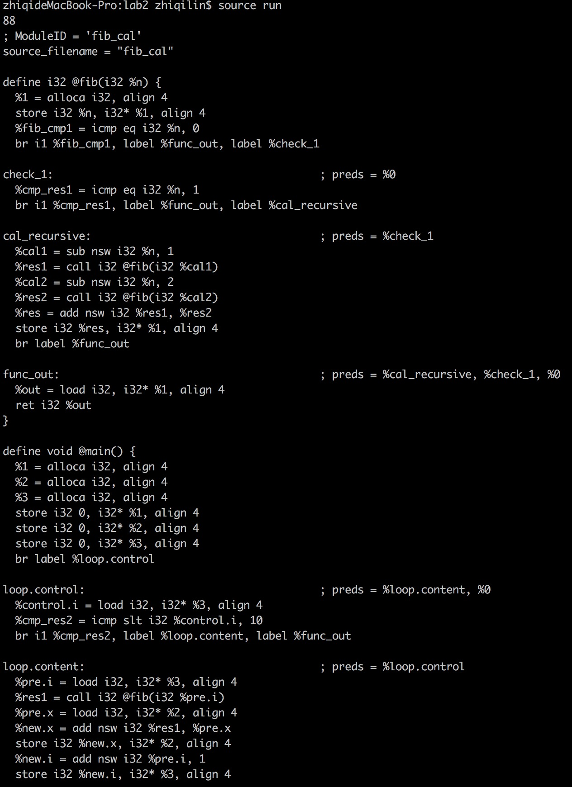
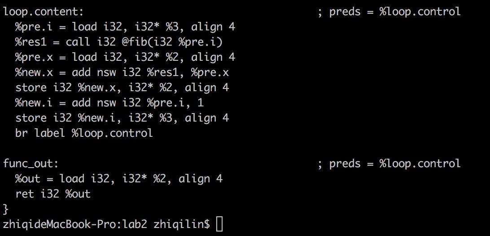

# lab2-预热实验 实验报告

## LLVM IR 手工翻译
这个过程首先要理解中间语言 LLVM IR 的定义.  

LLVM IR 中间语言的定义比较简单，跟汇编语言的编程模式非常像，主要通过 Label 在 BasicBlock 间进行跳转，每个 BasicBlock 最后都是跳转语句或者退出函数语句。所以对 LLVM IR BasicBlock 的划分需要注意。  

好在 LLVM IR 中有了 alloca 这样的语句，是得当出现循环等情况时能通过 alloca 来保存循环控制体和循环主体对循环变量的迭代更新，使得 BasicBlock 划分较为容易。  

具体的部分划分部分可以参考目录下的 fib.ll 来进行查看。

## LLVM gen_fib.cpp 实现
实现这个部分需要了解 LLVM IRBuilder 编程接口。

IRBuilder 中通过定义 Module 和 Function，并将 Function 插入到 Module 中，然后在 Function 中逐条插入 IR 指令来完成整个 IRBuilder 过程。  

其中，需要了解 LLVM IRBuilder 的 Type 接口，本次实现中仅需要用到 Type::getInt32Ty(LLVMContext context) 接口和 ConstantInt::get(...)接口； 还需要了解每个指令的创建接口，典型的创建接口为 builder.CreateXXX(Value *p1, ...), 其中 XXX 表示对应的指令名，可以再 llvm/IRBuilder.h 头文件中找到相关定义。

实现结果可以查看目录下的 gen\_fib.cpp 这个文件。

## 代码编译以及使用
* 使用 source 指令 一次性查看所有结果:  
  ```
  $source run
  ```
  输出结果中 88 为 fib.ll 执行 `lli` 后使用 `echo $?` 得到的结果;  
  剩下的打印输出结果为 gen_fib.cpp 的执行结果。  
  (如果遇到便已出现问题，请手工执行随后提到的 gen_fib.cpp 编译命令，原因是此编译命令不一定适用于所有系统。)

* fib.ll 使用： 在文件目录下执行  
  ```
  $lli fib.ll
  $echo $?
  ```  
  即可查看结果。

* gen_fib.cpp 编译与运行： 在文件目录下执行  
  ```
  $ make
  ```
  如果此命令执行失败（已知在 macOS High Sirra 下能够执行成功），请执行：  
  ```
  $ c++ gen_fib.cpp `llvm-config --cxxflags --ldflags --system-libs --libs` -o gen_fib
  ```

## 实验结果
实验结果符合预期，输出代码与 lli 执行代码相同。一下为实验效果图：  






## 问题记录以及解决方案

编译问题：

* 编译助教给的 llvm-irgen-example.cpp 时出现编译报错，助教给的编译命令如下：

  ```c++ `llvm-config --cxxflags --ldflags —libs` llvm-irgen-example.cpp -o llvm-irgen-example```

  出现报错提示:

  ```
  Undefined symbols for architecture x86_64:
    "_del_curterm", referenced from:
        llvm::sys::Process::FileDescriptorHasColors(int) in libLLVMSupport.a(Process.cpp.o)
    "_set_curterm", referenced from:
        llvm::sys::Process::FileDescriptorHasColors(int) in libLLVMSupport.a(Process.cpp.o)
    "_setupterm", referenced from:
        llvm::sys::Process::FileDescriptorHasColors(int) in libLLVMSupport.a(Process.cpp.o)
    "_tigetnum", referenced from:
        llvm::sys::Process::FileDescriptorHasColors(int) in libLLVMSupport.a(Process.cpp.o)
  ld: symbol(s) not found for architecture x86_64
  clang: error: linker command failed with exit code 1 (use -v to see invocation)
  ```

  解决方案：编译命令修改为如下即可正常编译(添加一个—system-libs 即可)

  ```
  $ c++ `llvm-config --cxxflags --ldflags --system-libs --libs` llvm-irgen-example.cpp -o llvm-irgen-example
  ```

  ​